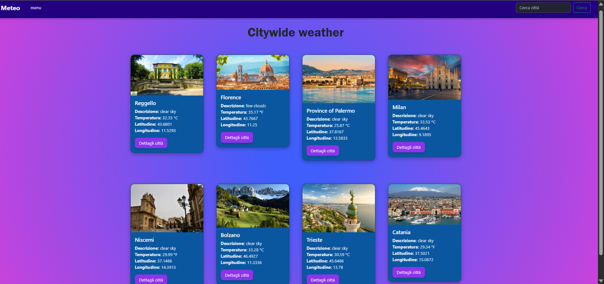

# 🌤️ App Meteo

Una semplice applicazione meteo sviluppata con **HTML**, **CSS** e **JavaScript** che consente all’utente di cercare una città, visualizzare le condizioni meteo attuali e Leggere una descrizioni della città.

## 🚀 Funzionalità principali

- 🔍 Ricerca del meteo per città
- 🔍 Ricerca descrizione per città
- 🌡️ Visualizzazione della temperatura attuale
- 🌧️ Condizioni atmosferiche (nuvoloso, pioggia, ecc.)
- 🌍 Integrazione con l’API di OpenWeatherMap

## 🛠️ Tecnologie utilizzate

- HTML5
- CSS3
- JavaScript
- OpenWeatherMap API

## 📸 Screenshot



## 🧪 Come provarla

1. Clona il repository:
   ```bash
   git clone https://github.com/11292-stella/App_Meteo.git
